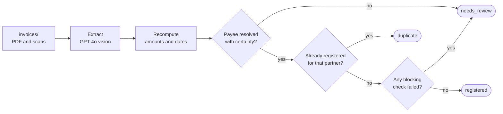

# Invoice Intake

Reads Japanese supplier invoices, PDFs and scans alike, with a vision model.
Recomputes every number locally. Registers only what it can prove into the
accounting API, and hands the rest to a human with a reason.

## Run

```bash
python3 -m venv .venv && source .venv/bin/activate
pip install -r requirements.txt
cp .env.example .env          # set OPENAI_API_KEY
python3 run.py --reset
```

Python 3.9+ (tested on 3.12) and an OpenAI API key. Nothing else: the mock
accounting API ships with the repo and starts on its own.

## What happens



Nothing is registered on the model's word. Amounts and tax are recomputed exactly
the way the API computes them, both dates are parsed and sanity-checked, the payee
has to resolve to a single partner, and hand-altered bank details hold an invoice no
matter how well the numbers add up.

Results land in `output/summary.json`, with one detail file per invoice beside it.
A full sample run, video included, is in [`demo/`](demo/). Treat `output/` as
payment data: extractions carry supplier bank details lifted off the documents.

## Options

| Flag | |
|---|---|
| `--reset` | clear registered invoices first |
| `--dry-run` | extract and verify, register nothing |
| `--only invoice_09` | a single invoice |
| `--no-api-start` | require an API that is already running |

## Tests

```bash
python3 -m unittest discover -s tests -t .
```

27 cases over the verification rules, partner matching and date normalization.
No API key, no network.

---

Scope, design decisions, cost at volume, and the per-invoice result table are in
[SUBMISSION.md](SUBMISSION.md).
